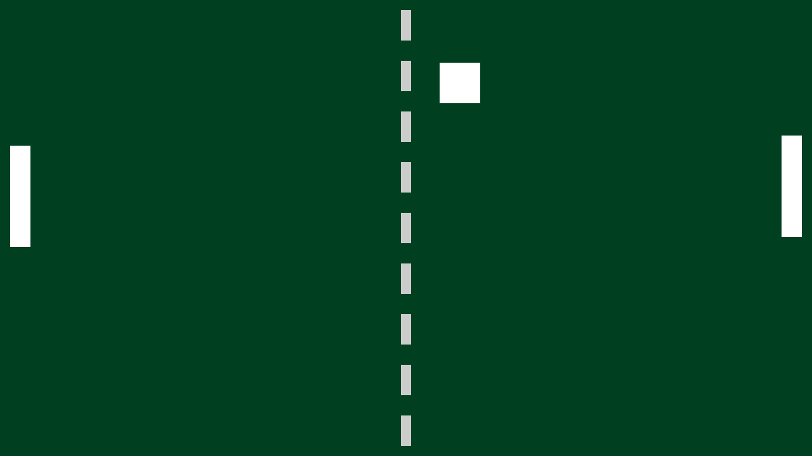

# 3. Synchroniseren

In deze opdracht ga je aan de slag met een pong "screensaver". Je splitst de code op in twee losse taken, en vervolgens gebruik je een spinlock om toegang tot hetzelfde geheugen vanuit de twee taken te synchroniseren.

## Voorbereiding

0.  Haal de laatste versie van FramboOS van GitHub.
    Dit kun je doen door in je bestaande repository `git pull` uit te voeren.
    Los eventuele merge conflicten op en controleer of je kernel nog steeds compileert en draait.

## De pong screensaver

Onze screensaver gaat er ongeveer zo uitzien:



Het speelveld omvat het hele scherm.
Aan de linker en rechter kant van het veld bevinden zich twee *paddles*.
Ongeveer in het midden zie je de bal, die heen en weer stuitert.
Beide paddles worden door de computer bestuurd.

## Opzet

Kijk in het bestand `src/user/tasks/pong.c`. Dit bestand bevat een incomplete implementatie van de screensaver.

Er is een `struct` om de toestand van de screensaver bij te houden:

```c
typedef struct {
    int ball_x;
    int ball_y;
    int speed_v;
    int speed_h;
    int left_paddle_y;
    int right_paddle_y;
} pong_state_t;

// ..

static volatile pong_state_t state = (pong_state_t) {
    .ball_x = 100,
    .ball_y = 100,
    .speed_v = -9,
    .speed_h = 7,
    .left_paddle_y = 0,
    .right_paddle_y = 200,
};
```

De functie `void state_tick(volatile pong_state_t *state)` voert een simulatie-stap uit op de toestand *state*. Deze functie is al voor je geïmplementeerd, hier hoef je niets in aan te passen.

De functie `void state_render(framebuffer_info_t *target_fb, volatile pong_state_t *state)` tekent de toestand *state* op de framebuffer *target_fb*. Deze functie is nog niet volledig geïmplementeerd.

De functie `void task_pong_tick_loop()` bevat de loop die de pong simulatie gaat draaien. De code maakt gebruik van de timer om de loop ongeveer 30 keer per seconde te laten draaien. De functie `void screensaver_start()` start deze taak.

## Voorbereiding

1.  Open `kernel.c`, en voeg een aanroep naar `screensaver_start()` toe. Plaats deze aanroep onder `kernel_init()`, maar voordat andere taken worden gestart.
2.  Open `pong.c`, en voeg aanroepen naar `state_tick` en `state_render` toe in `task_pong_tick_loop`:
    ```c
    state_tick(&state);
    state_render(fb, &state);
    ```

## Tekenen
We gaan nu `void state_render(..)` implementeren. Je kunt de volgende voorgedefinieerde waardes gebruiken:

```c
#define BALL_SIZE 64
#define PADDLE_HEIGHT 160
#define PADDLE_PADDING 16
#define PADDLE_WIDTH 32
```

Jouw implementatie hoeft er niet exact hetzelfde uit te zien als het screenshot. Als je andere kleuren (of vormen, bijv. [een cirkel](https://www.csfieldguide.org.nz/en/chapters/computer-graphics/drawing-lines-and-circles/) voor de bal) gebruikt is dat ook prima.

3.  Voeg code toe om de twee paddles en de bal te tekenen. Maak gebruik van de functie `draw_rectangle` die je eerder hebt geschreven. Teken op de framebuffer `target_fb`.
    - Teken de bal als een vierkant op positie `x = state.ball_x, y = state.ball_y` met grootte `BALL_SIZE`.
    - Teken de linker paddle als een rechthoek op positie `x = PADDLE_PADDING, y = state->left_paddle_y` met breedte `PADDLE_WIDTH` en hoogte `PADDLE_HEIGHT`.
    - Teken de rechter paddle als een rechthoek op positie `x = target_fb->width - PADDLE_PADDING - PADDLE_WIDTH, y = state->right_paddle_y` met breedte `PADDLE_WIDTH` en hoogte `PADDLE_HEIGHT`.
4.  Test je code. Wat gaat er nu mis?
5.  Voeg code toe om de achtergrond van het speelveld te tekenen.
    - Teken een rechthoek over de volledige grootte van het scherm.
    - Teken een paar rechthoeken in het midden van het scherm om de onderbroken lijn te tekenen.
6.  Test je code. Je ziet nu je eerste synchronisatieprobleem. Wat is dit probleem? Benoem welk geheugen er gedeeld wordt, en met wat. (Hint: denk ook aan de hardware!)

We gaan nu eerst naar een buffer tekenen, in plaats van direct naar het scherm. De globale variabele `framebuffer_info_t render_surface` is al voor je gedefinieerd.

7.  Pas de code in `void task_pong_tick_loop()` aan zodat je eerst naar `&render_surface` tekent. Kopieer vervolgens met `memcpy` de buffer `render_surface.buf` naar `fb->buf`. De grootte van deze buffer staat in `render_surface.buf_size`. Let op de volgorde van de argumenten van `memcpy`!
8.  Test je code. Als het goed is zie je niet meer hetzelfde als bij vraag 4. Hebben we het synchronisatieprobleem nu opgelost? Leg uit waarom het is opgelost, of benoem wat je nog van het probleem zou kunnen zien als je heel goed oplet.

> Hint: Als je de bal en paddles nu niet meer ziet, kijk dan nog eens naar de volgorde waarin je dingen op de framebuffer tekent.

Het tekenen van het veld en het updaten van de toestand gebeuren nu in sequentie. Na iedere update van de toestand tekenen we het veld één keer opnieuw. Als het tekenen van het veld meer tijd kost dan de 33ms die we hebben, dan loopt de hele simulatie langzamer.

Dit kan je testen door een synthetische vertraging in te voegen aan het einde van `void state_render(..)`. Bijvoorbeeld (of nog langer!):

```c
delay(10000000);
```

Vergeet niet om de aanroep naar `delay(10000000)` weer weg te halen voordat je doorgaat.

## Twee taken

We gaan zorgen dat onze simulatie altijd even snel loopt door het op te splitsen in twee taken. Een taak voor het updaten van de toestand, en een taak om de toestand op het scherm te tekenen. De taak om de toestand te updaten loopt altijd even snel, en de taak om de toestand op het scherm te tekenen zo snel als lukt.

9.  Voeg een tweede taak toe:
    ```c
    void task_pong_render_loop() {
        framebuffer_info_t *fb = framebuffer_get_info();
        while (true) {

        }
    }
    ```
10. Verplaats de code die op het scherm tekent van `task_pong_tick_loop` naar deze nieuwe taak (de aanroepen naar `state_render` en `memcpy`). Voeg code toe in `void screensaver_start()` om de nieuwe taak te starten.
11. Test je code. Als het goed is krijg je na enige seconden een kernel panic (`Ball is out of bounds`). Bekijk `state_tick` en `state_render`. Waardoor komt deze kernel panic? Beredeneer welk deel van `state_tick` we aan het uitvoeren zijn zodra we de kernel panic krijgen. Gebruik de letters A t/m G die in de comments in `state_tick` staan om naar de code te verwijzen.

## De spinlock

Om deze kernel panic op te lossen gaan we een *spinlock* gebruiken. Deze zal je zelf eerst moeten implementeren.

In `include/kernel/hardware/atomic.h` is de functie `bool atomic_compare_exchange(uint32_t *ptr, uint32_t expected_value, uint32_t new_value)` al voor je gedefinieerd. Deze functie voert een ondeelbare (*atomic*) *compare-exchange* operatie uit. Als de waarde in `ptr` gelijk is aan `expected_value` slaat de functie `new_value` op in `ptr`, en returnt `true`. Zoniet, dan wordt de waarde in `ptr` niet aangepast en returnt de functie `false`.

We gaan de spinlock implementeren in `src/user/spinlock.c`. In `include/user/spinlock.h` staan al een `struct` voor je gedefinieerd:

```c
typedef struct {
  uint32_t value;
} spinlock_t;
```

De spinlock heeft een veld: `value`. Als `value` 1 is, dan is de lock vrij om vergrendeld te worden. Als `value` 0 is, dan is de lock al vergrendeld.

12. Implementeer de functies `spinlock_create`, `spinlock_acquire`, en `spinlock_release` in `src/user/spinlock.c` met behulp van `atomic_compare_exchange`. (Hint: je kunt paragraaf 6.5 van het boek raadplegen als je er niet uit komt)

    - `spinlock_create` geeft een nieuwe spinlock met `value = 1` terug.
    - `spinlock_acquire` gebruikt een while loop om te wachten totdat de spinlock vergrendeld kan worden.
    - `spinlock_release` ontgrendelt de spinlock.

## Twee gesynchroniseerde taken

We gaan nu de spinlock gebruiken voor onze screensaver in `src/user/tasks/pong.c`.

13. Definieer een nieuwe globale variabele `static spinlock_t state_lock;` en initialiseer deze met `spinlock_create` in `screensaver_start`. Voeg aanroepen naar `spinlock_acquire` en `spinlock_release` toe in `void task_pong_render_loop()` en `void task_pong_tick_loop()`, zodat toegang tot `state` *mutually exclusive* is. Zorg dat je `spinlock_acquire` op de eerste regel van de `while` loop in `task_pong_render_loop` hebt staan, en `spinlock_release` op de laatste regel.
14. Test je code. Nu beweegt de bal niet meer! Leg uit waarom. (Hint: gebruik `uart_log_info` om te kijken welke code er wordt uitgevoerd)

Er zijn meerdere manieren om dit probleem op te lossen. Natuurlijk gaan wij proberen om het met meer synchronisatie op te lossen.

15. Definieer een tweede spinlock `static spinlock_t state_updated_event;` en initialiseer deze in `screensaver_start`. Plaats één aanroep naar `spinlock_acquire`, en één aanroep naar `spinlock_release` op de juiste plek om de bal weer te laten bewegen. Een in `void task_pong_render_loop()` en een in `void task_pong_tick_loop()`.
16. We gebruiken `state_updated_event` als een soort semafoor (soms een *auto-reset event semaphore* genoemd). Hoe verschilt dit met een echte semafoor? Maakt dat verschil in onze implementatie uit? Waarom wel/niet?

Als je nu weer een aanroep naar `delay(10000000)` toevoegt in `void state_render(..)` zal je merken dat de bal even snel blijft bewegen.

17. Misschien is je al opgevallen dat met alle synchronisatie die we hebben toegevoegd, de twee taken nu nooit tegelijk werk aan het doen zijn. Probeer daarom als laatste zo veel mogelijk code die niet afhankelijk is van de toestand `state`, buiten de *kritieke sectie* te plaatsen. Denk bijvoorbeeld aan de `memcpy` van de extra framebuffer naar het scherm.

## Inleveren

Lever een zip *van je hele project* in via yOUlearn.
Probeer dit te doen vóór de volgende bijeenkomst, dus voor dinsdag 10 januari.
Mocht dit niet lukken, neem dan contact op met de docent.
Geef hieronder aan hoeveel uren je met deze opdracht bezig bent geweest.

Tijd gestoken in deze opdracht: ... uur.

Het moeilijkste aan deze opdracht vond ik:

* ...

Het leukste aan deze opdracht vond ik:

* ...