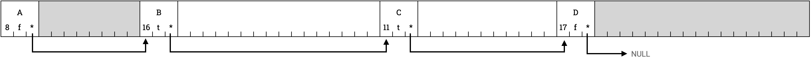

# 4. Alloceren

In deze vierde en laatste opdracht ga je een geheugen allocator schrijven voor FramboOS.
Deze opdracht is vrijer en neemt je minder mee aan de hand dan de vorige opdrachten.

## Voorbereiding

0.  Haal de laatste versie van FramboOS van GitHub.
    Dit kun je doen door in je bestaande repository `git pull` uit te voeren.
    Los eventuele merge conflicten op en controleer of je kernel nog steeds compileert en draait.

## Opzet

In `user/alloc.h` vind je de signaturen van `void* malloc(size_t)` en `void free(void*)`.

* `malloc` alloceert een blok geheugen van de opgegeven grootte, en geeft een pointer naar dat blok als resultaat.
* `free` dealloceert zo'n blok weer.

Ook vind je hier de functie `void malloc_init()` die de memory allocator initialiseert.
In deze opdracht ga je al deze drie functies zelf implementeren.

## Specificatie

Onderstaande specificatie omschrijft het *gedrag* van de drie functies die je moet implementeren.
Lees deze eerst goed door.
De specificatie is niet volledig, je zult zelf moeten bedenken hoe je jouw implementatie vormgeeft.

### Initialisatie

Na het aanroepen van `malloc_init()` zal er een initieel geheugenblok beschikbaar zijn.
Net als elk ander blok geheugen, wordt dit blok voorafgegaan door een *header*.
Deze header bevat de boekhouding van de geheugenallocator:

* de grootte van het geheugenblok;
* of het geheugenblok in gebruik is of niet; en
* een pointer naar het volgende geheugenblok.

De headers vormen dus een *linked list*.

Een initieel blok geheugen van 64 woorden ziet dat er als volgt uit:

### Alloceren

Elke keer wanneer er een aanvraag wordt gedaan voor een blok geheugen,
loopt `malloc()` door de lijst van headers heen op zoek naar een vrij blok dat groot genoeg is.
Dit blok wordt vervolgens *opgesplitst*:

* het eerste deel is het blok geheugen van de gevraagde grootte;
* het tweede deel is een nieuw blok geheugen dat nog leeg is.

De headers dienen op de juiste manier gemaakt dan wel aangepast te worden.
Wanneer er geen ruimte is voor een blok van de gevraagde grootte,
retourneren we de `NULL` pointer.

Als voorbeeld alloceren we eerst blok A van 8 woorden:

en vervolgens blok B van 16 woorden:

Blok C van 31 woorden blijft over als vrij geheugen.

### Dealloceren

Wanneer we ons voorbeeld vervolgen, en geheugenblok A dealloceren met `free()`,
houden we dat bij door in de header het geheugenblok op "vrij" te zetten:

Wanneer we nu een nieuw blok willen alloceren,
kunnen we controleren of dit vrije blok groot genoeg is om te gebruiken.
Wanneer dat niet zo is zoeken we door tot we een blok hebben gevonden dat wel aan deze voorwaarde voldoet.

Na het alloceren van blok C van 11 woorden, dat te groot is om in blok A te zetten, ziet ons geheugen er als volgt uit:

### Blokken samenvoegen

Een andere taak van `free()` is om twee of meer vrije blokken geheugen die naast elkaar liggen samen te voegen.
Wanneer we in ons voorbeeld blok B dealloceren,
is de situatie:

## Implementatie

In `user/alloc.c` vind je enkele hulpfuncties en lege implementaties van de gevraagde functies.

1.  Denk na over de velden die de header moet bevatten en implementeer de datastructuur `struct alloc_header_t`.
2.  Implementeer de functies `malloc_init()`, `free()`, en `malloc()` zodat ze aan bovenstaande specificatie voldoen.
    Maak hierbij gebruik van de gegeven hulpfuncties in `user/alloc.c` en onderstaande tips.

### Tips

* Voor FramboOS gaan we gaan uit van 16MiB aan geheugen,
  dat is niet veel, maar is voldoende om je te laten ervaren hoe geheugenallocatie werkt.
* De ARM architectuur eist uitgelijnde geheugen toegang.
  Dat wil zeggen dat alle geheugenblokken een veelvoud van 4 bytes moeten zijn.
  * Je header is als het goed is netjes een veelvoud van 4 bytes, controleer dit.
  * Binnen de functie `malloc()` zul je er voor moeten zorgen dat de gevraagde `size` een veelvoud is van 4.
    Dit is al voorgedefinieerd.
    **Vergeet dit niet!**
* Let op dat de header **geen** onderdeel is van het aangevraagde geheugenblok.
  Het is puur voor de boekhouding van de geheugenallocator.
  Dat betekent dat je te maken hebt met twee pointers:
  eentje naar de *header* van een blok, en
  eentje naar de *data* van een blok.
  Om te converteren tussen deze pointers kun je de voorgedefinieerde functies
  `void* header_to_dataptr(alloc_header_t*)` en
  `alloc_header_t* dataptr_to_header(void*)`
  in `user/alloc.c` gebruiken.
* Je kunt je implementatie testen door in je `void kernel_main()` de functie `void alloc_test()` aan te roepen.
  **Lever je werk niet in voordat alle tests slagen!**

## Inleveren

Lever een zip *van je hele project* in via yOUlearn.
Probeer dit te doen vóór de volgende bijeenkomst, dus voor dinsdag 24 januari.
Mocht dit niet lukken, neem dan contact op met de docent.
Geef hieronder aan hoeveel uren je met deze opdracht bezig bent geweest.

Tijd gestoken in deze opdracht: ___ uur.

Het moeilijkste aan deze opdracht vond ik:

* ___

Het leukste aan deze opdracht vond ik:

* ___